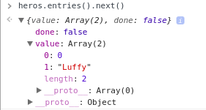

# [`Iterables`](https://developer.mozilla.org/fr/docs/Web/JavaScript/Reference/Les_protocoles_iteration) & [`Looping`](https://developer.mozilla.org/fr/docs/Web/JavaScript/Guide/Boucles_et_it%C3%A9ration)

## Loop

J'imagine que tu as déjà vu ce genre de boucle :
```js
const heros = ['Luffy', 'Naruto', 'Light', 'Sakuragi']

for (let i = 0; i < heros.length; i++) {
    console.log(heros[i])
}
```

Je te présente la boucle `forEach` :
```js
const heros = ['Luffy', 'Naruto', 'Light', 'Sakuragi']

heros.forEach(hero => console.log(hero))
```

Si tu l'utilises, tu n'auras pas le droit à ```break``` et ```continue``` :
```js
heros.forEach(hero => {
  if (hero === 'Light') {
    console.log('STOP')
    break // SyntaxError: Illegal break statement
  }
  console.log(hero) 
})
```

Il y a également le ```for ..in``` :
```js
for (const index in heros) {
    console.log(heros[index])
}
```

Mais je le déconseille car : 
```js
// De nombreuses librairies modifient les prototypes comme par exemple ici :
Array.prototype.shuffle = function() {
     var i = this.length, j, temp
     if ( i == 0 ) return this
     while ( --i ) {
      j = Math.floor( Math.random() * ( i + 1 ) )
      temp = this[i]
      this[i] = this[j]
      this[j] = temp
    }
    return this
}

for (const index in heros) {
    console.log(heros[index])
}
// Luffy
// Naruto
// Light
// Sakuragi
// [Function]
```

Sinon il y a le ```for ..of``` qui est plutôt cool, puisque ce dernier autorise ```break``` et n'affiche pas les *prototypes* modifiés :

```js
for (const hero of heros) {
  if (hero === 'Light') {
    break
  }
  console.log(hero)
}
// Luffy
// Naruto
```

## Iterables

Maintenant comment récupérer l'index avec un ```for ..of``` ?
Si tu viens de **Java**, tu dois connaître les *iterators*. En JS, pour récupérer un *iterator* sur un tableau on utilise **array.entries()** :



```js
const heros = ['Luffy', 'Naruto', 'Light', 'Sakuragi']

for (const hero of heros.entries()) {
  console.log(hero)
}
// [ 0, 'Luffy' ]
// [ 1, 'Naruto' ]
// [ 2, 'Light' ]
// [ 3, 'Sakuragi' ]
for (const hero of heros.entries()) {
  console.log(hero[0] + ' - ' + hero[1])
}
// 0 - Luffy
// 1 - Naruto
// 2 - Light
// 3 - Sakuragi

// On peut aussi destructurer le heros.entries() :
for (const [i, hero] of heros.entries()) {
  console.log(i + ' - ' + hero)
}
// 0 - Luffy
// 1 - Naruto
// 2 - Light
// 3 - Sakuragi
```

Les méthodes ```Object.values``` et ```Object.entries``` ne sont pas encore disponibles. Si tu veux parcourir un objet avec un ```for ..of```, tu peux utiliser la méthode ```Object.keys```

```js
const pomme = {
  couleur: 'rouge',
  provenance : 'espagne',
  juteuse : true
}

for (const prop of Object.keys(pomme)) {
  console.log(prop, ':' ,pomme[prop])
}
// couleur : rouge
// provenance : espagne
// juteuse : true
```

