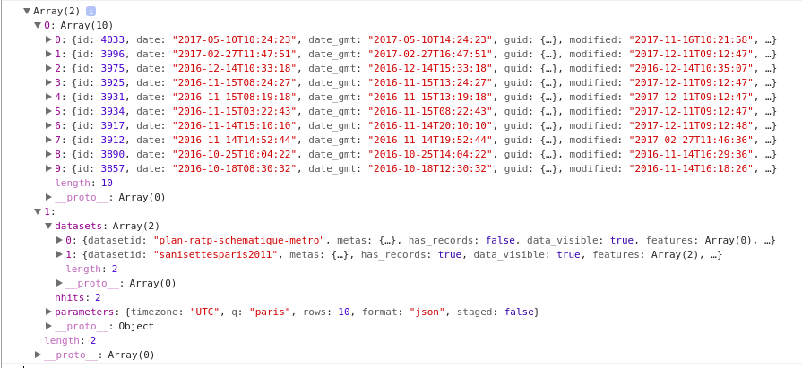

# `Promise`

## Une légère introduction... pourquoi les promesses ?

À certains moment dans votre application, vous devez attendre la réponse d'un serveur avant d'executer une certaine portion de code. Par exemple, vous demandez à votre base de données la liste d'amis d'un utilisateur pour ensuite l'afficher.

La gestion de ce délai s'appelle la programmation *asynchrone*.

Seulement, le JS étant un langage mono-thread, le fait de devoir attendre qu'un serveur nous envoit une réponse devient facilement bloquant pour le reste du programme.

Pour pallier à celà, les développeurs utilisaient le sytème de callbacks. Le principe ? Au lieu d'attendre la valeur de retour d'une fonction, on passe en second argument une fonction qui sera exécutée avec la valeur voulue (quand elle sera disponible). En voici un exemple :
```js
faireQqc(function(result) {
  faireAutreChose(result, function(newResult) {
    faireUnTroisiemeTruc(newResult, function(finalResult) {
      console.log('Résultat final :' + finalResult);
    }, failureCallback);
  }, failureCallback);
}, failureCallback);
```

Mais là encore il y a plusieurs problèmes :
- le code devient verbeux (parle beaucoup, utilise beaucoup de mots, souvent pour dire peu.)
- mais aussi difficile à lire et à comprendre
- cela implique que ça devient plus compliqué de le faire évoluer.

Toutefois, depuis l'ES6 nous avons l'objet `Promise`.

Concrètement, il va nous permettre plusieurs choses :
- Ne plus se perdre dans les callbacks imbriquées.
- Pouvoir faire des traitements asynchrones de manière simultanée tout en récupérant les résultats une seule fois simplement.

Même si on a pas encore vraiment vu ce que c'était, le code précédent se tranformerait en :
```js
faireQqc()
  .then(result => faireAutreChose(result))
  .then(newResult => faireUnTroisiemeTruc(newResult))
  .then(finalResult => console.log('Résultat final : ' + finalResult))
  .catch(failureCallback)
```

> L'objet `Promise` (pour « promesse ») est utilisé pour réaliser des traitements de façon asynchrone. Une promesse représente une valeur qui peut être disponible maintenant, dans le futur voire jamais. Source : [MDN](https://developer.mozilla.org/fr/docs/Web/JavaScript/Reference/Objets_globaux/Promise)

## Comment est-ce qu'on les utilises ?

Pour reprendre l'exemple de [Jecelyn Yeen](https://scotch.io/tutorials/javascript-promises-for-dummies), imagine que t'es un **gamin**. Ta **maman** te *promet* de t'acheter un **téléphone**.

Elle peut très bien ne pas tenir sa *promesse* : si tu n'as pas été **sage** par exemple.

On sait que la *promesse* peut être soit : 
- **pending** (*en attente*) : état initial, la promesse n'est ni remplie, ni rompue 
- **fulfilled** (*tenue*) : l'opération a réussie 
- **rejected** (*rompue*) : l'opération a échouée 
- **settled** (*acquittée*) : la promesse est tenue ou rompue mais elle n'est plus en attente.

Eh bien, en JS,  c'est la même chose avec l'objet `Promise`.

```js
new Promise( function(success, failure) { ... } );
```

On appelle donc la fonction :
- `success` si l'opération a réussie.
- `failure` lorsque l'opération a échouée.

>Généralement, et même sur la doc, ces fonctions s'apellent `resolve` et `reject` mais cela n'as pas d'importance.

```js
const enfantSage = true

// Promise
const avoirUnPhone = new Promise((success, failure) => {
    if (enfantSage) {
        const phone = {
            marque: 'Iphone',
            couleur: 'blanc'
        }
        success(phone) // fulfilled
    } else {
        const raison = new Error('mom is not happy')
        failure(raison) // rejected
    }
})
//pending ..
avoirUnPhone
    .then(phone => console.log(phone))
    // enfantSage = true -> { marque: 'Iphone', couleur: 'blanc' }
    .catch(raison => console.log(raison))
    // enfantSage = false -> Error: mom is not happy 
```

Autre exemple, imagine qu'après un entretien d'embauche, la RH te *promet* de te donner une réponse d'ici les 3 prochains jours.

- Success.
```js
console.log("Tu passes l'entretien")
// la RH te fait la promesse que tu auras un retour d'ici peu
const reponseRH = new Promise((success, failure) => {
    // on imagine que la réponse n'est pas immédiate (ici 3 secondes) donc :
    setTimeout(() => success("Super, tu es pris ! Tu commences demain ;)"), 3000)    
})
console.log("Tu retournes à tes petites affaires")
// lorsque tu recois la réponse
reponseRH
    .then(reponse => console.log(reponse)) // en cas de success
    .catch(refus => console.err(refus)) // en cas de failure
```


- Failure.
```js
console.log("Tu passes l'entretien")
// la RH te fait la promesse que tu auras un retour d'ici peu
const reponseRH = new Promise((success, failure) => {
    // on imagine que la réponse n'est pas immédiate (ici 3 secondes) donc :
    setTimeout(() => failure("Désolé, bon courage pour la suite"), 3000)    
})
console.log("Tu retournes à tes petites affaires")
// lorsque tu recois la réponse
reponseRH
    .then(reponse => console.log(reponse)) // en cas de success
    .catch(refus => console.error(refus)) // en cas de failure
```


### Chaîner les promesses

Maintenant, admettons que ceci soit ta BD :
```js
const posts = [
    { title: 'I love JavaScript', author: 'Wes Bos', id: 1 },
    { title: 'CSS!', author: 'Chris Coyier', id: 2 },
    { title: 'Dev tools tricks', author: 'Addy Osmani', id: 3 }
]

const auteurs = [
    { name: 'Wes Bos', twitter: '@wesbos', bio: 'Canadian Developer' },
    { name: 'Chris Coyier', twitter: '@chriscoyier', bio: 'CSS Tricks and CodePen' },
    { name: 'Addy Osmani', twitter: '@addyosmani', bio: 'Googler' }
]
```

Tu peux jouer avec de cette façon : 
```js
const getPostById = (id) => {
  return new Promise((success, failure) => {
    // simule le fait que ça prend du temps vu que c'est une pseudo-requête
    setTimeout(() => {
      const post = posts.find(post => post.id === id)
      
      post ? success(post) : failure(Error('Post not found!'))
    },200)
  })
}

const joinAuthor = (post) => {
  return new Promise((success, failure) => {
    // simule le fait que ça prend du temps vu que c'est une pseudo-requête
    setTimeout(() => {
      const authorDetails = authors.find(person => person.name === post.author)
      
      if(authorDetails) {
        post.author = authorDetails
        success(post)
      } else {
        failure(Error('Author not Found!'))
      }
    }, 200)
  })
}

getPostById(1)
  .then(post => joinAuthor(post))
  .then(author => console.log(author))
  .catch(err => console.error(err))
// { title: 'I love JavaScript',
//   author: 
//    { name: 'Wes Bos',
//      twitter: '@wesbos',
//      bio: 'Canadian Developer' 
//    },
//   id: 1 
// }
```

On peut également utiliser `all` de cette manière par exemple :

```js
// j'enleve les setTimeout, vous avez compris à quoi ils servaient désormais
const weather = new Promise(resolve => resolve({ temp: 29, conditions: 'Sunny with Clouds'}) );

const tweets = new Promise(resolve => resolve(['I like cake', 'BBQ is good too!']));

Promise
  .all([weather, tweets])
  .then(responses => {
    const [weatherInfo, tweetInfo] = responses;
    console.log(weatherInfo, tweetInfo)
  })
```

### Exemple concret

On peut utiliser la fonction [fetch]() pour récupérer des données depuis une URL. `fecth` renvoit un objet `Promise`.

```js
const postsPromise = fetch('http://wesbos.com/wp-json/wp/v2/posts')
const ratpPromise = fetch('http://data.ratp.fr/api/datasets/1.0/search/?q=paris')

Promise
    .all([postsPromise, ratpPromise])
    .then(responses => Promise.all(responses.map(res => res.json())))
    .then(responses => console.log(responses))

```

> **Note** : Installez browser-sync, il vous permettra d'émuler un serveur web avec la commande `npm install -g browser-sync`. Autrement vous obtiendrez une erreur car votre url commence par *file://*.
> Une fois fait, lancez votre serveur avec `browser-sync start --directory --server --files "*.js, *.html, *.css"`.



## Liens utiles

- [Utiliser les promesses](https://developer.mozilla.org/fr/docs/Web/JavaScript/Guide/Utiliser_les_promesses)