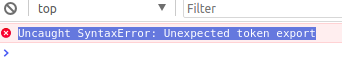
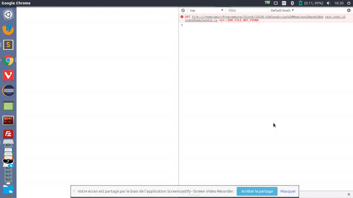

# JS modules & [`npm`](https://www.npmjs.com/)

Lors du développement de votre application, vous aurez certainement besoin d'utiliser des fonctions provenant de librairies externes. 

Les _modules_ JavaScript nous permettent de découper notre code dans des fichiers séparés au sein de notre projet ou d'utiliser des _modules_ open source que nous pouvons installer via **npm** par exemple.

>**npm** a commencé en tant que gestionnaire de paquets pour Node.js, mais il a depuis évolué pour devenir le gestionnaire de paquets pour JavaScript et le développement de front end en général.

Pour celà,  nous utilisons `import` et des `export` : instructions pour partager des choses (variables, fonctions, objets ...) entre les fichiers. Chaque fichier va **importer** les dépendances dont il a besoin et **exporter**tout ce qu'il veut rendre disponibles dans les autres fichiers.


## Nos propres modules

Admettons que l'on veuille faire une boutique en ligne, nous aurons probablement besoin de développer un service d'assistance. Nous allons l'appeler `helper.js` :

```js
const taxRate = 0.13
const couponCodes = ['BLACKFRIDAY', 'FREESHIP', 'HOHOHO']

const addTax = (price) => price * (1 + taxRate)

const discountPrice = (price, percentage) => price * (1 - percentage)
```

Maintenant on veut que nos autres fichiers puissent utiliser nos fonctions et avoir au couponCodes.

### [`export`](https://developer.mozilla.org/fr/docs/Web/JavaScript/Reference/Instructions/export)

Il y a 3 manière de le faire :

Ajouter export avant nos déclarations :
```js
const taxRate = 0.13
const couponCodes = ['BLACKFRIDAY', 'FREESHIP', 'HOHOHO']

export const addTax = (price) => price * (1 + taxRate);

export const discountPrice = (price, percentage) => price * (1 - percentage);
```

exporter après nos déclarations :
```js
export couponCodes
export addTax
export discountPrice
```

Ou tout à la fois :
```js
export { couponCodes, addTax, discountPrice }
```

Il existe l'`export default`,lorsque l'on souhaite n'exporter qu'une seule valeur.

```js
const taxRate = 0.13
export default const couponCodes = ['BLACKFRIDAY', 'FREESHIP', 'HOHOHO']

const addTax = (price) => price * (1 + taxRate)
const discountPrice = (price, percentage) => price * (1 - percentage)
```

### [`import`](https://developer.mozilla.org/fr/docs/Web/JavaScript/Reference/Instructions/import)

Très bien et donc pour récupérer tout ça :

```js
// On indique le chemin vers le fichier sans indiquer le .js
import * from './helper'
const displayTotal = addTax(1000)
// Si vous voulez importer comme si c'était un objet 
import * as h from './helper'
const displayTotal = h.discountPrice(500, 0.33)
```

Ou pour prendre uniquement ce dont vous avez besoin :
```js
import { couponCodes, discountPrice } from './helper'
const discount = discountPrice(500, 0.33)
// Renommer plusieurs exports
import { couponCodes as coupons, discountPrice as prixShop } from './helper'
console.log(coupons) // ['BLACKFRIDAY', 'FREESHIP', 'HOHOHO']
```

Il existe l'`import default` dans le cas d'un `export default` :

```js
import couponCodes from './helper';
```

## Modules extérieurs

1. Tout d'abord, lancez la commande `npm init`, un fichier `package.json` sera créé. 
2. Installez ensuite le paquet qui vous plaît à l'aide `npm install packagename --save`,  s'ajouteront alors une propriété `"dependencies"` à votre `package.json` ,et un dossier `node_modules`. 
3. Si vous supprimez ce dossier par inadvertance, vous n'avez qu'à lancer `npm install`, **npm** lira alors les dépendances de votre projet dans le `package.json` et s'occupera de réinstaller ce dont vous avez besoin.

## Erreurs fréquentes et Webpack 

Cette erreur doit vous être familière :



Puisque nos navigateurs ne comprennent pas encore les modules ES6, nous avons besoin d'outils pour les faire fonctionner aujourd'hui. Pour celà, on utilise un `bundler` qui s'occupera de compiler notre code en un seul fichier Javascript ou en plusieurs bundles pour différentes parties de votre application. 

>Quelques bundlers populaires : [webpack](https://webpack.github.io/), [browserify](http://browserify.org/)

Je vais ici installer `webpack` avec `npm install webpack --save` pour ne plus avir ce problème. Je crée le fichier de configuration `webpack.config.js` auquel j'ajoute :
- La clé `entry:` qui indique le chemin du fichier de où commence votre application.
- La clé `output:` qui indique e nom de fichier que nous aimerions que webpack génère.
- La clé `module:` qui contient le tableau `loaders`. Ce dernier indique à webpack comment il doit gérer des types spécifiques de fichiers.

```js
module.exports = {
    entry: './app.js',
    output: {
        filename: './bundle.js'
    },
    module: {
        loaders: [
            {
                test: /\.js$/,
                exclude: /node_modules/
            }
        ]
    }
}
```

Mon fichier `test.html` :
```html
<!DOCTYPE html>
<html>
<head>
    <title></title>
</head>
<body>
    <p id="sum"></p>
    <p id="sub"></p>
</body>
<script src="bundle.js"></script>
</html>
```

Mon fichier `math.js` :
```js
const sum = (a, b) => a + b
const sub = (a, b) => a - b

export {sum, sub}
```

Mon fichier `app.js` :
```js
import {sum, sub} from './math'

const sumResult = document.querySelector('#sum')
const subResult = document.querySelector('#sub')

sumResult.textContent = `Le résultat de 2 + 2 : ${sum(2, 2)}`
subResult.textContent = `Le résultat de 2 - 2 : ${sub(2, 2)}`
```

La dernière partie du puzzle est d'initier la construction du fichier `bundle.js` par webpack. 

```json
"scripts": {
    "start": "npm run webpack",
    "webpack": "webpack -d --watch"
},
```

On lance ensuite `npm start`, c'est là que webpack génère notre fichier `bundle.js`

Le résultat :



## Ressources 

- [getting-started-with-webpack-and-es6-modules](https://medium.com/@svinkle/getting-started-with-webpack-and-es6-modules-c465d053d988)


