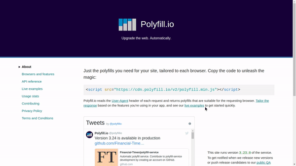

# ES6 Tooling

## 1. SystemJS
Si tu trouves qu'utiliser `webpack` c'est long, qu'il y avait beaucoup de choses à faire, je te conseille d'utilser `SystemJS`.

Insérer dans votre fichier html la ligne suivante :
```html
<script src="https://jspm.io/system@0.19.js"></script>
```

**JSPM** correspond à JavaScript Package Manager.
>Ce n'est pas une alternative à **npm**. Il se situe au dessus.

Pourquoi est ce que je vous présente `SystemJS` ? Avec lui, on peut très rapidement utiliser `import` et `export` dans notre navigateur, que ce soit pour nos propres fichiers ou de librairies externes. Le tout, sans rien installer !

>Toutefois il faudra quand même créer votre `package.json` (avec `npm init`) et ouvrir votre fichier depuis un serveur (Python, PHP ...). Sinon vous pouvez utiliser `browser-sync`.

1. Précisez que `browser-sync` est un de vos outils de développement avec `npm install browser-sync --save-dev`.

2. Dans votre  remplacez cette ligne :
```json
"scripts": {
    "test": "echo \"Error: no test specified\" && exit 1"
},
```

par celle-ci :
```json
"scripts": {
    "server" : "browser-sync start --directory --server --files '*.js, *.html, *.css'"
},
```

Ainsi vous pourrez lancer `npm run server`.

Maintenant vous n'avez plus qu'à ajouter votre script :

```html
<script>
        System.config({ transpiler: 'babel' })
        System.import('./filename.js') // préciser le chemin de votre appli
</script>
```

```js
// si je veux récupérer une dépendance depuis npm
import { sum, kebabCase } from 'npm:lodash' 
// si je veux récupérer une dépendance depuis un de mes fichier
import { addTax } from './checkout'

console.log(kebabCase("I'm soooo cool ⛓⛓⛓⛓"))

console.log(addTax(100, 0.15))
```

>Vous contaterez qu'il prends quelques secondes avant de se lancer. Je le ne recommande donc pas si vous développez une grosse application.

## 2. Babel

Dans le cas où votre appli doit pouvoir tourner sur des vieilles versions de navigateur, vous allez devoir utiliser un `transpiler` commme [Babel](https://babeljs.io/).

Je vous recommande de suivre ce [lien](https://medium.com/@tmtushar28/getting-started-with-webpack-aae37062c01) pour commencer.

>Vous devez apprendre à lire de la doc, chercher sur Google. J'ai intentionnellement laisser les liens pour Babel, sans décrire les étapes pour que vous vous débrouillez.

## 3. Polyfill

Ok on sait maintenant que **Babel** convertit notre code ES6 en code ES5. 
Mais nous n'avons fait ici que la moitié du chemin.

**Babel** ne fonctionne que sur la syntaxe (arrow function, template strings, const, let ...). En effet, il ne convertira pas certaines nouvelles méthodes comme [`Array.from()`](https://developer.mozilla.org/fr/docs/Web/JavaScript/Reference/Objets_globaux/Array/from). Dans ces cas là, nous utilisons des `Polyfill`.

C'est très simple, `Polyfill` en gros c'est : *"si le navigateur ne l'implémente pas, nous allons le récréer avec du Javascript"*. Et ce qui est plutôt cool, c'est que [MDN](https://developer.mozilla.org/fr/docs/Web/JavaScript) ajoute toujours une section `Polyfill` sur la doc des nouvelles méthodes. Allez y vérifier pour [`Array.from()`](https://developer.mozilla.org/fr/docs/Web/JavaScript/Reference/Objets_globaux/Array/from). Et ce qui l'est encore plus, c'est que plutôt que de copier-coller à chaque fois, on tout simplement utiliser les [polyfill de Babel](https://babeljs.io/docs/usage/polyfill/). Et encore mieux, il y a [Polyfill.io](https://polyfill.io/v2/docs/).

Vous n'avez qu'à ajouter : 
```html
<script src="https://cdn.polyfill.io/v2/polyfill.min.js"></script>
```

Et il s'occupera du reste.

_Petite astuce_ : Si vous voulez simuler un vieux navigateur, allez dans la console de Chrome `Ctrl + Shift + i`. Dans la partie `Elements`, allez tout en bas, à gauche de `Console` vous trouverez un petit menu sous forme de `...` verticaux. Cliquez dessus, choisissez `Network Conditions`. Décochez `User agent [x] Select automatically` et vous devriez pouvoir choisir ce qui vous plaît avec `custom`.

