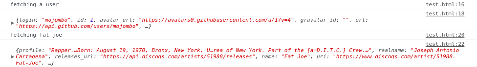

# [`Generators`](https://developer.mozilla.org/fr/docs/Web/JavaScript/Guide/iterateurs_et_generateurs#Générateurs)

>Un **générateur** est un type de fonction spécial qui fonctionne comme une fabrique (factory) d'**itérateurs**. Une fonction devient un générateur lorsqu'elle contient une ou plusieurs expressions `yield` et qu'elle utilise la syntaxe `function*`. Source [MDN](https://developer.mozilla.org/fr/docs/Web/JavaScript/Guide/iterateurs_et_generateurs#Générateurs)

Un **générateur** c'est en quelque sorte une fonction qui a plusieurs *return* sur lesquels on peut itérer à l'aide de :
- `yield` permet d'interrompe et de reprendre un **générateur**.

> Pour ceux qui viennent du C, cela peut s'apparenter aux instructions de contrôle..mais en plus utiles !

## Fonction "en pause"
```js
/* Exemple - 1 */
function* myGenerator() {
    yield 'fist step'
    yield 'second step'
    yield 'third step'
}

const test = myGenerator()
console.log(test.next()) // { value: 'fist step', done: false }
console.log(test.next()) // { value: 'second step', done: false }
console.log(test.next()) // { value: 'third step', done: false }
console.log(test.next()) // { value: undefined, done: true }
/* Exemple - 2 */
function* myGenerator2() {
  let i = 0
  yield i
  i++
  yield i
  i++
  yield i
}
const test2 = myGenerator2()
console.log(test2.next()) // { value: 0, done: false }
console.log(test2.next()) // { value: 1, done: false }
console.log(test2.next()) // { value: 2, done: false }
console.log(test2.next()) // { value: undefined, done: true }

/* Exemple - 3 */
const inventors = [
  { first: 'Albert', last: 'Einstein', year: 1879 },
  { first: 'Isaac', last: 'Newton', year: 1643 },
  { first: 'Galileo', last: 'Galilei', year: 1564 },
  { first: 'Marie', last: 'Curie', year: 1867 },
  { first: 'Johannes', last: 'Kepler', year: 1571 },
  { first: 'Nicolaus', last: 'Copernicus', year: 1473 },
  { first: 'Max', last: 'Planck', year: 1858 },
];

function* loop(arr) {
  for (const item of arr) {
    yield item
  }
}

const inventorGen = loop(inventors)

console.log(inventorGen.next()) 
// { value: { first: 'Albert', last: 'Einstein', year: 1879 }, done: false }
// ...
```

C'est un pattern très pratique, pour les listes infinies par exemple :

```js
function* fibo() {
  let [a, b] = [1, 1]
  while (true) {
    // Who can stop me?
    [a, b] = [b, a + b]
    yield a
  }
}

const iterator = fibo()
for (let n of iterator) {
  if (n >= 100) {
    break // *I* can stop you
  }
  console.log(n)
}
// 1 2 3 5 8 13 21 34 55 89
```


## Passage de valeur au générateur

```js
function* math() {
  // Le premier appel à next() permet de "démarrer" le générateur
  const x = yield // la valeur de la première itération sera undefined
  // x = le paramètre du second appel à next() -> 33
  const y = yield x + 1 // valeur de la seconde itération : x + 1
  // y = paramètre du troisième appel à next() -> 27
  yield y // valeur de la troisième itération : y
  // le 4e appel (et +) à next() retournent { value: undefined, done: true }
}

const iterator = math()
iterator.next(42) // { value: undefined, done: false }
// Passer un paramètre au premier appel à next() n'est pas utile : cette valeur
// n'est pas accessible dans le générateur car aucun "yield" correspondant

iterator.next(33) // { value: 34, done: false }, x = 33 dans le générateur
iterator.next(27) // { value: 27, done: false }, y = 27 dans le générateur
iterator.next() // { value: undefined, done: true 
```

Un autre exemple sera peut-être plus parlant :
```js
function* gen() {
  while(true) {
    var value = yield null
    console.log(value) // ici le programme finira par afficher 2
  }
}

var g = gen()
g.next(1) // "{ value: null, done: false }"
g.next(2) // "{ value: null, done: false }"
```

## Ajax Exemple

```js
const ajax = url => fetch(url)
    .then(data => data.json())
    .then(data => dataGen.next(data)) 
    // stockera dans la variable correponsdante, le résultat de la requête
    // puis passera à la suivante

function* steps() {
  console.log('fetching a user')
  const mojombo = yield ajax('https://api.github.com/users/mojombo')
  console.log(mojombo)

  console.log('fetching fat joe')
  const fatJoe = yield ajax('https://api.discogs.com/artists/51988')
  console.log(fatJoe)
}

const dataGen = steps()
dataGen.next() // kick it off
```



On peut également utiliser la boucle `for..of` sur les **générateur** :

```js
function* lyrics() {
  yield `Où sont les cerfs ? ` 
  yield `Dans la forêt.` 
  yield `Qu'est-ce qu'ils y font ?` 
  yield `Ils y travaillent.` 
  yield `À quel métier ?` 
  yield `Au charpentier.` 
  yield `Faut-il les tuer ?` 
  yield `Noooon` 
}

const chant = lyrics()

for (const ligne of chant) {
  console.log(ligne)
}
// Où sont les cerfs ? 
// Dans la forêt.
// Qu'est-ce qu'ils y font ?
// Ils y travaillent.
// À quel métier ?
// Au charpentier.
// Faut-il les tuer ?
// Noooon
```

## Ressources

- [Itérateurs et générateurs](http://putaindecode.io/fr/articles/js/es2015/generators/)