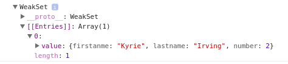

# [`Sets`](https://developer.mozilla.org/fr/docs/Web/JavaScript/Reference/Objets_globaux/Set) & [`WeakSets`](https://developer.mozilla.org/fr/docs/Web/JavaScript/Reference/Objets_globaux/WeakSet)

## Set

>Si tu viens de Java tu dois connaître les Sets

Concrètement `Set` c'est comme un tableau, une liste, dont les éléments ne peuvent apparaître qu'une seule fois. De plus on ne peut accéder à un élément depuis un indice.

```js
const students = new Set(['Antoine', 'Bineta', 'Idriss'])
console.log(students[0]) // undefined
```

Quelques méthodes utiles :

- `add()`
```js
const students = new Set()

students.add('Antoine')
students.add('Bineta')
students.add('Idriss')

console.log(students) // Set { 'Antoine', 'Bineta', 'Idriss' }
students.add('Idriss') // Idriss n'est pas ajouté, il est déjà dans students
console.log(students) // Set { 'Antoine', 'Bineta', 'Idriss' }
```

- `has()`
```js
const students = new Set(['Antoine', 'Bineta', 'Idriss'])
console.log(students.has('Romain')) // false
console.log(students.has('Bineta')) // true
```

- `size` et pas `length`
```js
const students = new Set(['Antoine', 'Bineta', 'Idriss'])
console.log(students.size) // 3
```

- `delete()`
```js
const students = new Set(['Antoine', 'Bineta', 'Idriss'])
students.delete('Antoine')
console.log(students) // Set { 'Bineta', 'Idriss' }
```

- `clear()`
```js
const students = new Set(['Antoine', 'Bineta', 'Idriss'])
students.clear()
console.log(students) // Set {}
```

Pour parcourir un `Set` :
```js
const students = new Set(['Antoine', 'Bineta', 'Idriss'])
for (const student of students) {
  console.log(student)
}
// Antoine
// Bineta
// Idriss
```

- `values()`
```js
const students = new Set(['Antoine', 'Bineta', 'Idriss'])
const it = students.values()
console.log(it) //SetIterator { 'Antoine', 'Bineta', 'Idriss' }
console.log(it.next().value) // Antoine
console.log(it) // SetIterator { 'Bineta', 'Idriss' }
console.log(it.next().value) // Bineta
console.log(it) // SetIterator { 'Idriss' }
console.log(it.next().value) // Idriss
console.log(it) // SetIterator {  }
console.log(it.next().value) // undefined
```

- `keys()` pas de différence avec le précédent :
```js
const students = new Set(['Antoine', 'Bineta', 'Idriss'])
const it = students.keys()
console.log(it) //SetIterator { 'Antoine', 'Bineta', 'Idriss' }
console.log(it.next().value) // Antoine
console.log(it) // SetIterator { 'Bineta', 'Idriss' }
console.log(it.next().value) // Bineta
console.log(it) // SetIterator { 'Idriss' }
console.log(it.next().value) // Idriss
console.log(it) // SetIterator {  }
console.log(it.next().value) // undefined
```

- `entries()`
```js
const students = new Set(['Antoine', 'Bineta', 'Idriss'])
console.log(students.entries())
// SetIterator {
//   [ 'Antoine', 'Antoine' ],
//   [ 'Bineta', 'Bineta' ],
//   [ 'Idriss', 'Idriss' ] }
```

## WeakSet

C'est la même chose qu'un Set, seulement il ne peut contenir que des valeurs de type objets.
```js
/* Error */
const weakStudents = new WeakSet(['Antoine', 'Bineta', 'Idriss']) // TypeError: Invalid value used in weak set
const players = new WeakSet('Kobe', 'Kyrie', 'Eliot') // TypeError: Invalid value used in weak set
const numbers = new WeakSet(true, 45) // TypeError: undefined is not a function

/* Real Syntax */
const kobe = { firstanme:'Kobe', lastname: 'Bryant', number: 24}
const kyrie = { firstanme:'Kyrie', lastname: 'Irving', number: 2}
const players = new WeakSet([ kobe, kyrie ])

console.log(players.has(kobe)) // true
console.log(players.has(kyrie)) // true
```

Par ailleurs, on ne peut pas le parcourir. 
```js
for (const player of players) { // TypeError: players[Symbol.iterator] is not a function
  console.log(player)
}
```

Il n'y a pas non plus de `clear()`:
```js
players.clear() // TypeError: players.clear is not a function
```

On peut alors se demander, pourquoi ? Et en quoi est-ce que c'est utile ?

Eh bien le `WeakSet` est équipé d'un `garbage collector`. Admettons que je supprime l'objet `kobe` de mon code, il sera automatiquement supprimé dans le `WeakSet` :

```js
let kobe = { firstanme:'Kobe', lastname: 'Bryant', number: 24}
let kyrie = { firstanme:'Kyrie', lastname: 'Irving', number: 2}
const players = new WeakSet([ kobe, kyrie ])

kobe = null
console.log(players)
```



Seules les méthodes `add`, `delete` et `has` sont présentes dans son prototype

>*The advantage of a WeakSet here is that its contents can be garbage-collected while your algorithm is still running, so it helps to reduce memory consumption (or even prevents leaks) when you are dealing with lots of data that is lazily (possibly even asynchronously) produced.* [**Source**](https://stackoverflow.com/questions/30556078/ecmascript-6-what-is-weakset-for)
