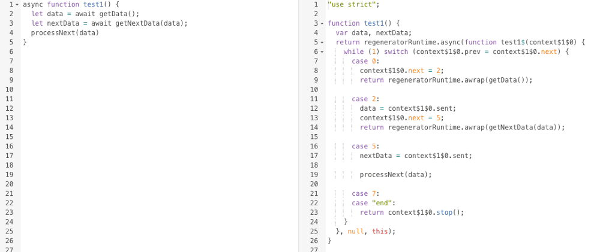

# [`Async`](https://developer.mozilla.org/fr/docs/Web/JavaScript/Reference/Instructions/async_function) + [` Await`](https://developer.mozilla.org/fr/docs/Web/JavaScript/Reference/Op%C3%A9rateurs/await)

>Bon avant de commencer, j'aimerais vous prévenir que les avis me semblent mitigés quand à son utilisation. Mais ma volonté étant de découvrir les outils, expliquer ce que j'en ai compris et présenter quelques use-cases, je vais quand même vous parler d'async await.

## Rappel

- Quand on execute du code **synchrone** on doit attendre qu'une tâche soit terminée avant de passer à une autre. 
- Tandis qu'en **asynchrone**, lorsque l'on exécute une tâche, on peut directement passer à une autre tâche avant que la précédente ne soit terminée.

Jusqu'ici pour traiter des promesses chaînées on le faisait de cette manière :
```js
/* Exemple 1 */
fetch('https://api.github.com/users')
    .then(res => res.json())
    .then(res => console.log(res))
    .catch(err => console.error(err))
/* Exemple 2 */
// ... some code
promiseRequest(oAuthOptions()).then(response => {
  const token = JSON.parse(response).access_token
  return promiseRequest(searchOptions(token))
}).then(response => {
  const search = JSON.parse(response)
  search.statuses.forEach(status => console.log(status.text))
})
```

## Combinaison : `Promises` + `Generators`

Si on combine ces deux-là, on se rapproche d'une syntaxe synchrone :
```js
import co from 'co'

co(function *() {
  const oAuthResponse = yield promiseRequest(oAuthOptions())
  const token = JSON.parse(oAuthResponse).access_token
  const searchResponse = yield promiseRequest(searchOptions(token))
  const search = JSON.parse(searchResponse)
  search.statuses.forEach(status => console.log(status.text))
})
```
>La librairie 'co' que l'on voit ici, attend le retour d'une promesse pour relancer l'execution de la fonction.

## A quoi servent `async` et `await` ?

L'objectif d'`async` / `await` est de simplifier le chaînage des promesses.
> *Globalement, ça va vous permettre d'écrire du code asynchrone avec une logique synchrone.* [Grafikart](https://www.youtube.com/watch?v=uUZxHkcidps&t=20m52s).

`async`, placé devant la déclaration d'une fonction indique que cette dernière est asynchrone :
- `async` encapsule le résultat de la fonction dans une promesse.
- `async` permet d'utiliser `await` dans le corps de la fonction.

```js
async function func() {
  console.log('titi')
}

const myFunc = async () => console.log('toto')

func() // titi
myFunc() // toto
```

`await`, placé devant une promesse, permet de mettre "en attente" le reste de la fonction jusqu'à que la promesse soit acquittée :
- `await` ne peut être utilisé que dans une fonction `async`.
- `await` fonctionne avec les promesses mais pas avec les callbacks.
- si la promesse est rompue, `await` lève une exception avec la raison.

```js 
async function myFunction() {
  // result prend la valeur renvoyé par maPromise
  const result = await maPromise
  // on n'arrivera à cette ligne que lorsque "maPromise" sera résolue
}
```

En conclusion, c'est le même principe que l'exemple `Promise` + `Generators`. 
Il suffit de remplacer `function *` par `async function` et `yield` par `await` :
```js
async function start() {
  const authResponse = await promiseRequest(authOptions())
  const token = JSON.parse(authResponse).access_token
  const searchResponse = await promiseRequest(searchOptions(token))
  const search = JSON.parse(searchResponse)
  search.statuses.forEach(status => console.log(status.text))
}

start()
```

>**Attention:** Il ne faut pas confondre `await` et `Promise.all`. `Promise.all` vous permettra de « patienter » pendant l'exécution de plusieurs promesses en parallèle. Alors qu'avec `await` les promesses sont exécutées en série et pas en parallèle.

## Exemple concret + capture d'erreurs

*Ici je reprends l'exemple de [naholyr](http://putaindecode.io/fr/articles/js/es2016/async-await/).*
**Contexte**: Le 6 décembre, c'est la Saint-Nicolas, on veut envoyer un message à tous nos utilisateurs qui s'appellent Nicolas :

Sans `async / await` :
```js
function sendEmails(query) {
  const usersP = getUsers(query)
  // On récupère le champ "email" de tous les utilisateurs
  const emailsP = usersP.then(users => users.map(u => u.email))
  // Pour chaque email…
  const sentP = emailsP.then(emails =>
    emails.map(email => {
      // … on envoie un mail
      return sendMail(email, "Bonne fête")
    })
  )
  // On attend que tous les envois soient résolus
  return Promise.all(sentP)
}

sendEmails({ firstName: "Nicolas" })
  .then(() => console.log("OK"))
  .catch(() => console.error("FAIL"))
```

Avec `async / await` :
```js
async function sendEmails(query) {
  const users = await getUsers(query)
  const emails = users.map(u => u.email)
  const sentP = emails.map(email => sendMail(email, "Bonne fête"))
  return await Promise.all(sentP)
}

async function main() {
  // on utilise try...catch pour récupérer les erreurs
  try {
    await sendEmails({ firstName: "Nicolas" })
    console.log("OK")
  } catch (e) {
    console.error("FAIL")
  }
}

main()
```

Quel code est le plus concis ? le plus lisible ? C'est assez subjectif en réalité. 

Il faut également savoir que **toute abstraction a un coût**.

>code transpilé par babel pour async / await :

>code transpilé par babel pour des promesses chaînées :


## Liens

- [Async / Await avec ES8](https://www.smooth-code.com/articles/javascript-async-await)
- [async/await: It’s Good and Bad](https://medium.com/@benlesh/async-await-it-s-good-and-bad-15cf121ade40)
- [dotJS 2017 - Wes Bos - Async + Await](https://www.youtube.com/watch?v=9YkUCxvaLEk)
- [fonctions asynchrones (async/await)](http://putaindecode.io/fr/articles/js/es2016/async-await/)
- [async / await in JavaScript - What, Why and How - Fun Fun Function](https://www.youtube.com/watch?v=568g8hxJJp4)
- [What's wrong with async/ await? C# & JS](https://joashc.github.io/posts/2016-06-10-async-await.html)
- [Async/Await en JavaScript: exemples](https://www.xul.fr/ecmascript/async-await.php)
- [La programmation asynchrone javascript](https://www.itrust.fr/la-programmation-asynchrone-javascript/)